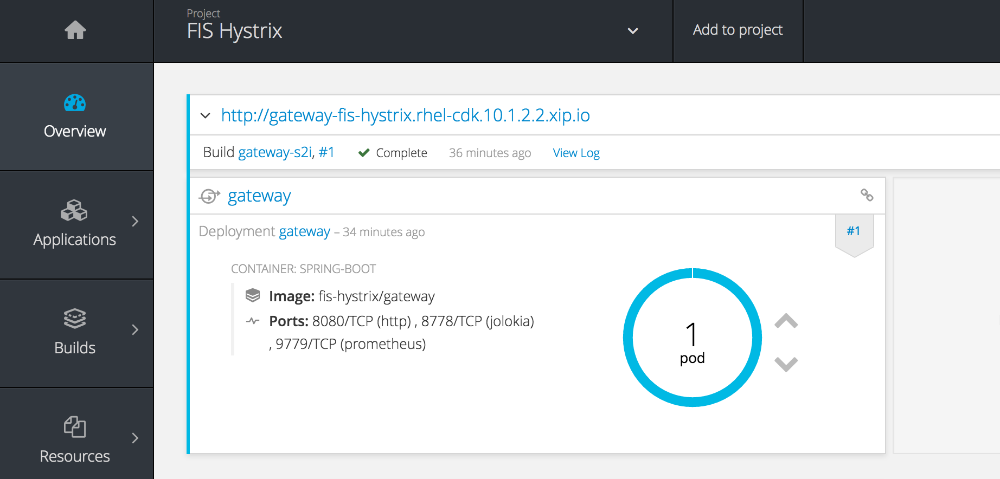
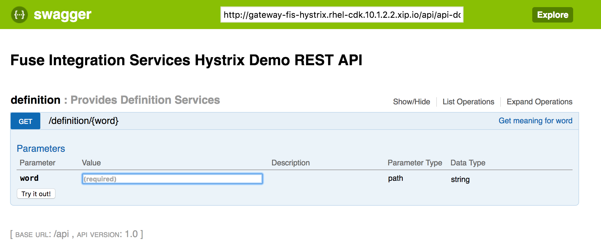

Fuse Integration Services (FIS) Hystrix Demo
====================================

Demonstration of the Netflix OSS [Hystrix](https://github.com/Netflix/Hystrix) fault tolerance library with Fuse Integration Services

## Overview

This project demonstrates a microservices based project that leverages Hystrix to provide fault tolerance for remote systems and invocations. A gateway application integrated with Hystrix stands in front of various  microservices providing language based services. 

## Components

The following components are included within the project:

* [Kubeflix](https://github.com/fabric8io/kubeflix) - Kubernetes integration with the Netflix OSS library
	* [Hystrix Dashboard](https://github.com/Netflix/Hystrix/tree/master/hystrix-dashboard) - Visualization of hystrix results
	* [Turbine](https://github.com/Netflix/Turbine) - Aggregates multiple hystrix streams
* Gateway Microservice - Hystrix enabled gateway for backend microservices
* Definition Microservice - Provides the definition for words

## Prerequisites

An OpenShift environment must be present for deployment to to a cloud environment

## Deployment

This project can be deployed using two methods:

* Automated installation using an [init.sh](init.sh) script
* Building and deploying each microservice along with instantiation of the Kubeflix ecosystem

### Using the init script

The [init.sh](init.sh) script automates the instantiation of the components contained within this project. It will deploy the Kubeflix ecosystem (Hystrix dashboard and Turbine server) as well performs a Source to Image (S2I) build and deployment for each microservice.

First, login to the OpenShift cluster using the `oc` tool. 

Next, execute the *init.sh* script

```
./init.sh
```

Monitor the microservices builds using `oc get builds` and the status of the deployed pods using `oc get pods` to confirm the project components start successfully.

## Manual build and deployment

The manual build and deployment method takes advantage of the [Fabric8 Maven Plugin](https://fabric8.io/gitbook/mavenPlugin.html) to build and deploy each microservice to OpenShift.

First, create a new OpenShift project called *fis-hystrix*

```
oc new-project fis-hystrix --description="Fuse Integration Services Hystrix Demo" --display-name="FIS Hystrix"
```

Within each microservices directory, execute the following command which will execute the *ocp* profile that executes the `clean fabric8:deploy` maven goal:

```
mvn -P ocp
```

The fabric8 maven plugin will perform the following actions:

* Compiles and packages the Java artifact
* Creates the OpenShift API objects
* Starts a Source to Image (S2I) binary build using the previously packaged artifact
* Deploys the application

After all applications are running, deploy the Hystrix dashboard and Turbine server using the provided [kubeflix.json](support/templates/kubeflix.json) template in the *support/templates* folder

Instantiate the template by executing the following command

```
oc process -f support/templates/kubeflix.json | oc create -f-
```

## Hystrix Dashboard

As part of the Kubeflix, the Hystrix Dashboard is deployed to provide a visualization of the metrics produced by Hystrix. This location of this dashboard can be accessed by executing the following command using the `oc` client:

```
oc get routes hystrix-dashboard --template='{{ .spec.host }}'
```
	
Using a web browser, navigate to the address obtained from the previous command. The URL of the stream provided by turbine is already repopulated. Click **Monitor Stream** to view the results from the gateway microservice

## Swagger UI

A [Swagger User Interface](http://swagger.io/swagger-ui/) is available within the gateway application to view and invoke the available services. 

Navigate to the gateway application. The URL can be found in the OpenShift Web Console



Select the hyperlink for the gateway application to launch the Swagger UI



The raw swagger definition can also be found at the context path `api/api-doc` 

## Command Line Testing

Using a command line, execute the following to query the definition service

```
curl -s http://$(oc get routes gateway --template='{{ .spec.host }}')/api/definition/camel | python -m json.tool
```
	
A successful response will output the following

```
{
    "definition": "Either of two large, humped, ruminant quadrupeds of the genus",
    "input": "camel"
}
```

